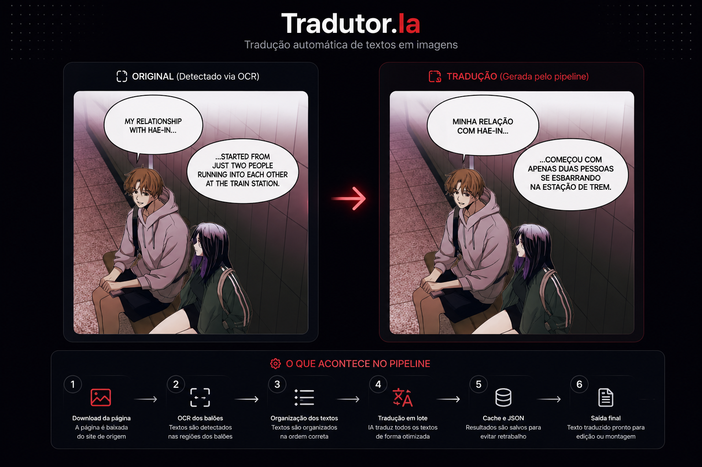

<div align="center">


<p>
  <a href="mailto:henriquepaiva128@gmail.com">
    
  </a>
  <a href="https://github.com/HenriquePvAr">
    
  </a>
  <a href="https://game-deals-alpha.vercel.app">
    
  </a>
</p>


</div>

<br>


## Sobre mim

Sou estudante de **Análise e Desenvolvimento de Sistemas** e estou construindo minha base como desenvolvedor com foco principal em **Python**.

Tenho interesse em automação, inteligência artificial, OCR, processamento de imagens, APIs, dados e desenvolvimento web.

Atualmente também atuo com **suporte técnico ao usuário**, realizando atendimento, diagnóstico de problemas, apoio a sistemas internos e colaboração com equipe técnica.

Meu objetivo é evoluir como desenvolvedor, criar soluções úteis e conquistar uma oportunidade de **estágio** ou **vaga júnior** em desenvolvimento de software.

Gosto de transformar ideias em ferramentas práticas, principalmente quando envolvem automação, APIs, OCR, IA, cache, processamento de dados e pipelines bem organizados.

<br clear="right"/>

---

<div align="center">


</div>

<div align="center">


</div>

<div align="center">


</div>

---

# Projeto em destaque

<div align="center">


<p>
  Pipeline em Python para automatizar tradução de páginas com texto em imagem, usando OCR, IA, cache e processamento em lote.
</p>

<p>
  
  
  
  
  
</p>

<p>
  <a href="https://github.com/HenriquePvAr/Tradutor.Ia">
    
  </a>
</p>

</div>

---

## Prévia visual

<div align="center">



</div>

---

## O que acontece no pipeline

<div align="center">

<table>
  <tr>
    <td align="center" width="16%">
      <strong>01</strong><br><br>
      <strong>Entrada</strong><br>
      <sub>Página local ou download automático</sub>
    </td>
    <td align="center" width="16%">
      <strong>02</strong><br><br>
      <strong>OCR</strong><br>
      <sub>Detecção dos textos nos balões</sub>
    </td>
    <td align="center" width="16%">
      <strong>03</strong><br><br>
      <strong>Organização</strong><br>
      <sub>Textos ordenados para tradução</sub>
    </td>
    <td align="center" width="16%">
      <strong>04</strong><br><br>
      <strong>Tradução</strong><br>
      <sub>Blocos enviados em lote para IA</sub>
    </td>
    <td align="center" width="16%">
      <strong>05</strong><br><br>
      <strong>Cache</strong><br>
      <sub>Evita chamadas repetidas</sub>
    </td>
    <td align="center" width="16%">
      <strong>06</strong><br><br>
      <strong>Saída</strong><br>
      <sub>JSON, TXT, imagem ou PDF</sub>
    </td>
  </tr>
</table>

</div>

<br>

<div align="center">


</div>

---

## Exemplo de tradução

<table>
  <tr>
    <td width="50%">
      <h3 align="center">Texto detectado pelo OCR</h3>
    </td>
    <td width="50%">
      <h3 align="center">Resultado em PT-BR</h3>
    </td>
  </tr>
  <tr>
    <td>
      <pre>
My relationship with Hae-In...

...started from just two people
running into each other
at the train station.
      </pre>
    </td>
    <td>
      <pre>
Minha relação com Hae-In...

...começou com apenas duas pessoas
se esbarrando
na estação de trem.
      </pre>
    </td>
  </tr>
</table>

---

## Funcionalidades do Tradutor.Ia

<div align="center">

<table>
  <tr>
    <td align="center" width="33%">
      <strong>OCR organizado</strong><br>
      <sub>Identificação dos textos dentro das imagens</sub>
    </td>
    <td align="center" width="33%">
      <strong>Tradução em lote</strong><br>
      <sub>Menos chamadas e melhor aproveitamento da API</sub>
    </td>
    <td align="center" width="33%">
      <strong>Cache inteligente</strong><br>
      <sub>Evita retraduzir conteúdo repetido</sub>
    </td>
  </tr>
  <tr>
    <td align="center" width="33%">
      <strong>JSON/TXT</strong><br>
      <sub>Resultados salvos de forma organizada</sub>
    </td>
    <td align="center" width="33%">
      <strong>Imagem/PDF</strong><br>
      <sub>Base para saída final editada</sub>
    </td>
    <td align="center" width="33%">
      <strong>Pipeline evolutivo</strong><br>
      <sub>Estrutura preparada para melhorias</sub>
    </td>
  </tr>
</table>

</div>

---

## Por que esse projeto é importante

O **Tradutor.Ia** é meu projeto principal porque reúne várias áreas que estou estudando e aplicando na prática:

<div align="center">


</div>

---

## Stack que estou fortalecendo

<div align="center">

<table>
  <tr>
    <td align="center" width="25%">
      
      <br>
      <strong>Python</strong>
      <br>
      <sub>Scripts, automação, dados e pipelines</sub>
    </td>
    <td align="center" width="25%">
      
      <br>
      <strong>OCR & Visão Computacional</strong>
      <br>
      <sub>Texto em imagem, OpenCV e processamento visual</sub>
    </td>
    <td align="center" width="25%">
      
      <br>
      <strong>Dados</strong>
      <br>
      <sub>Manipulação, organização e estruturas de saída</sub>
    </td>
    <td align="center" width="25%">
      
      <br>
      <strong>Web</strong>
      <br>
      <sub>Interfaces, HTML, CSS e JavaScript</sub>
    </td>
  </tr>
</table>

</div>

---

## Tecnologias e ferramentas

<div align="center">

### Python e dados

<p>
  
  
  
  
</p>

### Automação, OCR e imagem

<p>
  
  
  
  
</p>

### IA, APIs e Machine Learning

<p>
  
  
  
  
</p>

### Web e ferramentas

<p>
  
  
  
  
  
</p>

</div>

---

## Ambiente de desenvolvimento

<div align="center">

<table>
  <tr>
    <td align="center" width="25%">
      <strong>Editor</strong><br>
      <sub>VS Code e PyCharm</sub><br><br>
      
    </td>
    <td align="center" width="25%">
      <strong>Linguagem principal</strong><br>
      <sub>Python</sub><br><br>
      
    </td>
    <td align="center" width="25%">
      <strong>Foco atual</strong><br>
      <sub>OCR, IA e automação</sub><br><br>
      
    </td>
    <td align="center" width="25%">
      <strong>Organização</strong><br>
      <sub>Projetos, cache e pipelines</sub><br><br>
      
    </td>
  </tr>
</table>

</div>

---

## Estudos e evolução

Atualmente estou aprofundando meus estudos em áreas ligadas ao ecossistema Python e aplicações práticas com IA.

<div align="center">

<table>
  <tr>
    <td align="center" width="25%"><strong>Python aplicado</strong><br><sub>projetos práticos</sub></td>
    <td align="center" width="25%"><strong>Automação</strong><br><sub>tarefas e scripts</sub></td>
    <td align="center" width="25%"><strong>APIs</strong><br><sub>integrações e dados</sub></td>
    <td align="center" width="25%"><strong>OCR</strong><br><sub>texto em imagem</sub></td>
  </tr>
  <tr>
    <td align="center" width="25%"><strong>Machine Learning</strong><br><sub>modelos e conceitos</sub></td>
    <td align="center" width="25%"><strong>NLP</strong><br><sub>tradução e linguagem</sub></td>
    <td align="center" width="25%"><strong>Visão Computacional</strong><br><sub>imagem e processamento</sub></td>
    <td align="center" width="25%"><strong>Boas práticas</strong><br><sub>organização e evolução</sub></td>
  </tr>
</table>

</div>

---

## Repositórios em destaque

<div align="center">

<a href="https://github.com/HenriquePvAr/Tradutor.Ia">
  
</a>

<a href="https://github.com/HenriquePvAr/analisador-logs-android">
  
</a>

</div>

---

## Conquistas e evolução

<div align="center">


</div>

---

## Outros projetos e estudos

<div align="center">

<table>
  <tr>
    <td width="50%">
      <h3 align="center">Analisador de Logs Android</h3>
      <p align="center">
        Ferramenta em Python para analisar logs Android e identificar possíveis problemas como crashes, ANRs e uso de memória.
      </p>
      <p align="center">
        
        
        
      </p>
    </td>
    <td width="50%">
      <h3 align="center">Automação com Python</h3>
      <p align="center">
        Scripts e pequenos projetos voltados para automação, organização de arquivos, integração com APIs e produtividade.
      </p>
      <p align="center">
        
        
        
      </p>
    </td>
  </tr>
  <tr>
    <td width="50%">
      <h3 align="center">Desenvolvimento Web</h3>
      <p align="center">
        Estudos e projetos com HTML, CSS e JavaScript, com foco em interfaces responsivas, organização visual e experiência do usuário.
      </p>
      <p align="center">
        
        
        
      </p>
    </td>
    <td width="50%">
      <h3 align="center">IA, OCR e Dados</h3>
      <p align="center">
        Estudos em inteligência artificial, OCR, Machine Learning, NLP, análise de dados e aplicações práticas com Python.
      </p>
      <p align="center">
        
        
        
      </p>
    </td>
  </tr>
</table>

</div>

---

## Formação

**Análise e Desenvolvimento de Sistemas**  
Centro Universitário ESBAM  
2025 - 2027

---

## Cursos e certificações

- HTML5 e CSS3 - Curso em Vídeo
- Python para Análise de Dados, Data Science e Machine Learning - Data Science Academy
- Fundamentos de Data Science e Inteligência Artificial - Data Science Academy
- Fundamentos de Engenharia de Dados - Data Science Academy
- Power BI para Business Intelligence e Data Science - Data Science Academy
- Introdução à Cibersegurança - Cisco Networking Academy

---

## Estatísticas do GitHub

<div align="center">


</div>

<br>

<div align="center">


</div>

---

## Atividade

<div align="center">


</div>

---

<div align="center">


</div>

---

## Objetivo

Busco crescer como desenvolvedor, aplicar meus conhecimentos em projetos úteis e evoluir tecnicamente todos os dias.

Tenho interesse principalmente em:

<div align="center">


</div>

---

<div align="center">

## Contato

<p>
  <a href="mailto:henriquepaiva128@gmail.com">
    
  </a>
</p>


</div>


```
