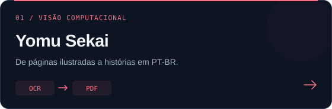
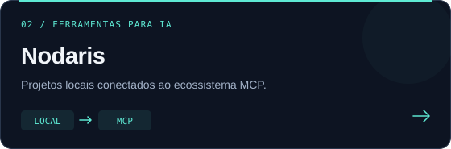

# Olá, eu sou o Henrique.

**Python · TypeScript · Automação · IA aplicada**

Sou estudante de **Análise e Desenvolvimento de Sistemas** e desenvolvo ferramentas com **Python e TypeScript**. Meu foco está em automação, integração de APIs e inteligência artificial aplicada a problemas concretos.

Também trabalho com **suporte técnico**. Investigar falhas, entender o que o usuário precisa e encontrar a causa de um problema fazem parte da minha rotina — e da forma como construo software.

## O que estou construindo

<table>
<tr>
<td width="50%" valign="top">

Um aplicativo para traduzir capítulos de mangás e webtoons para português. Reconhece o texto nas imagens, traduz as falas, aplica a tradução nas páginas e organiza o resultado em PDF, com revisão de qualidade.

<strong>Python · OpenCV · RapidOCR · Automação</strong> Em desenvolvimento · beta técnica

<a href="https://github.com/HenriquePvAr/Tradutor.Ia"><strong>Conhecer o Yomu Sekai →</strong></a>
</td>
<td width="50%" valign="top">

Uma ponte entre assistentes de IA e projetos no computador. Permite consultar arquivos, entender o código e inspecionar alterações Git nas pastas que você autoriza, usando o protocolo MCP.

<strong>TypeScript · Node.js · MCP · Integrações</strong> Runtime local para Windows

<a href="https://github.com/HenriquePvAr/Nodaris"><strong>Explorar o Nodaris →</strong></a>
</td>
</tr>
</table>

## Onde concentro meu trabalho

| Área | O que desenvolvo |
| :--- | :--- |
| **Automação e backend** | Scripts, APIs, processamento em lote e integração entre sistemas com Python e Node.js. |
| **OCR e visão computacional** | Reconhecimento de texto, processamento de imagens e pipelines com OpenCV e RapidOCR. |
| **Aplicações web** | Interfaces com React, JavaScript, TypeScript e Tailwind CSS. |
| **IA aplicada** | Integração de serviços de IA e ferramentas MCP com validação e revisão dos resultados. |

## Como penso software

**Entender o problema → construir → testar → melhorar.**

Gosto de projetos que conectam diferentes tecnologias e entregam algo utilizável. Tenho interesse tanto na interface que a pessoa vê quanto no processo que faz tudo funcionar por trás.

---

  <strong>Vamos construir alguma coisa?</strong> 
  Aberto a projetos, troca de conhecimento e oportunidades em desenvolvimento.  
  <a href="mailto:henriquepaiva128@gmail.com">henriquepaiva128@gmail.com</a>

